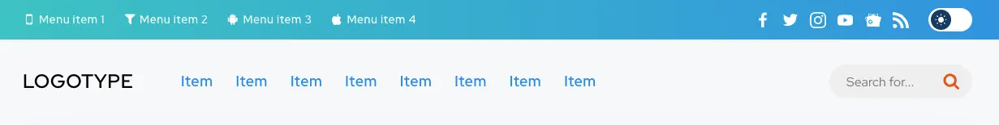
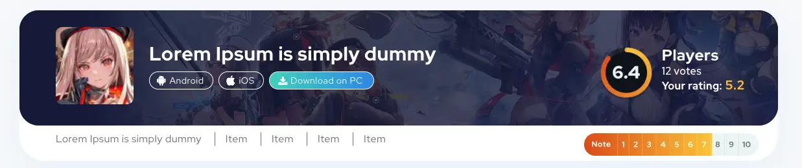
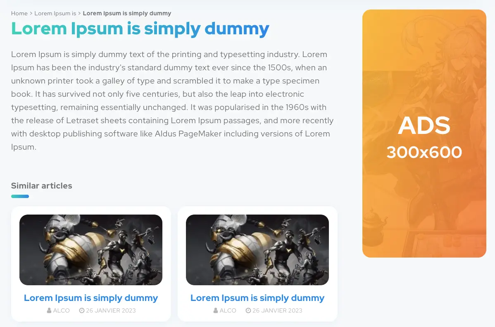
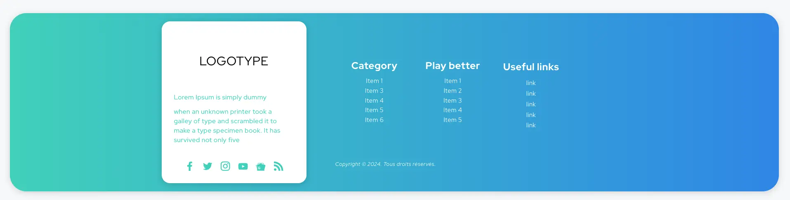
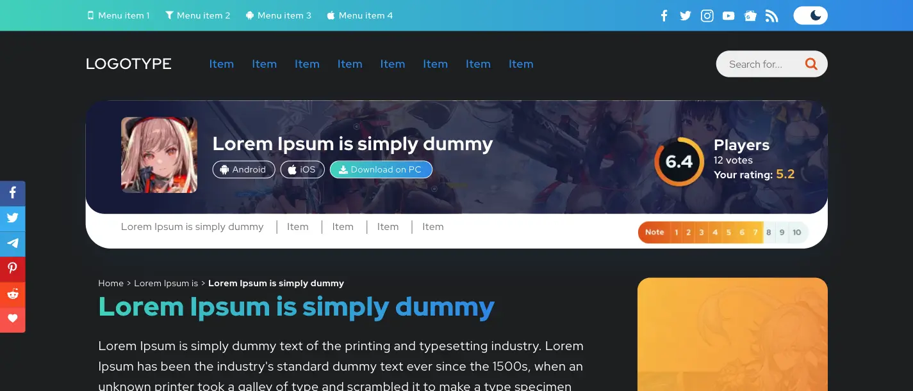
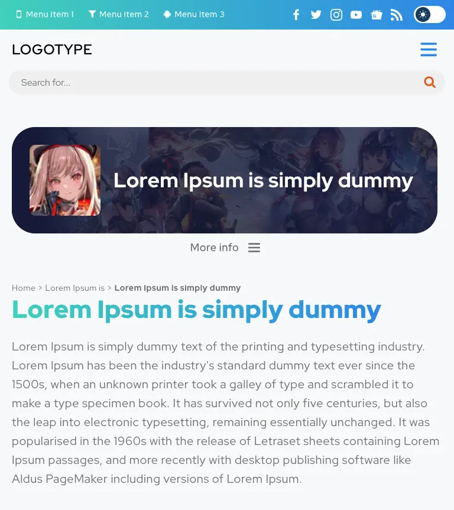

<h1 align="center">Gameshop Test App</h1>

Даний додаток - це тестове завдання, яке імітує сторінку сайту з інформацією про різний ігровий контент.

У завданні використовувалися такі технологіЇ:

- HTML5,
- SCSS,
- JavaScript,
- React.js.

Всі зображення були оптимізовані за допомогою Squoosh https://squoosh.app/

<h3 align="center">gameshop-test</h3>
Це головна сторінка, на якій є :

- header
  

- main content, який складається з баннеру,
  

його опису, карток із схожим контентом та рекламного блоку з правої сторони

- footer
  

Тут є також перемикач теми "light/dark" та Sidebar з лівої сторони екрану у десктопної версії сайту з посиланнями на соціальні мережі

<h3 align="center">Mobile version</h3>
Також існує мобільна версія сторінки.

<h3 align="center">Tablet version</h3>
Та планшетна версія сторінки.

**Використання прикладу:**

1.  Встановити всі залежності за допомогою команди npm install .
2.  Запустити додаток за допомогою команди npm start .
    Додаток буде доступний у браузері за адресою http://localhost:3000.
